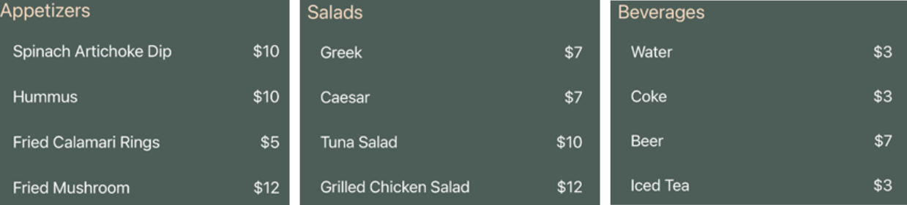
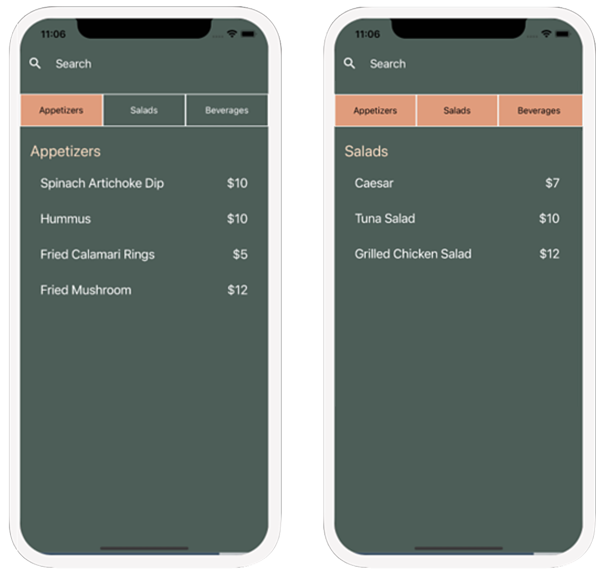

# Sample Snack app

Snack is Open Source. You can find the code on the [GitHub repo](https://github.com/expo/snack).

  
<strong>Snack category:</strong>

    

      
    

  
<strong>Snack filter:</strong>

    

      
    

### _Star this repository if it is useful. Thank you ! :)_